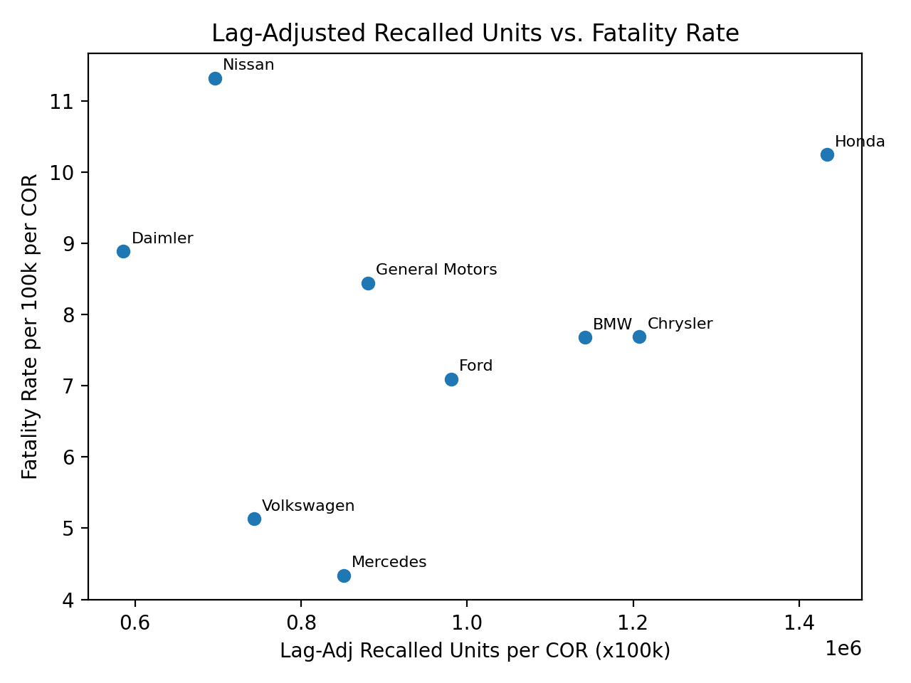

# Vehicle Recalls and Fatalities: Manufacturer-Level Analysis
 
Exploratory analysis of whether manufacturers with more recalled vehicles also have higher crash fatality rates. Python, pandas, scikit-learn.
 
**Result in one line:** across the nine manufacturers studied, recalled units per vehicle on the road show no clear linear pattern with fatality rate, and a separate regression analysis run for the course project found vehicle exposure (cars on the road) a stronger predictor of deaths than recalls. 

## The problem
 
The two public datasets have no shared key. The recalls file lists *manufacturers* ("GENERAL MOTORS, LLC"), while the crash file lists *makes* ("CHEVROLET"). Neither has the number of vehicles each manufacturer has on the road, which is needed to compare large and small manufacturers fairly. Most of this project is solving those two problems before any modeling.
 
## What `analysis.py` does
 
| Step | What it does |
|---|---|
| Data quality check | Reports percent missing in each column of interest and stops if any exceeds 30% |
| Manufacturer mapping | Hand-built dictionary of 37 raw names (e.g. Acura, Infiniti, Dodge, Porsche) to 9 parent manufacturers, applied to both datasets so they can be joined; rows outside the nine are dropped |
| Time window | 2010-2024. Recall year is parsed from the date string; crash records are filtered on vehicle model year |
| Recall lag | Repairs take time, so a recall in year Y counts for Y and the next 3 years (4x for 2010-2021, then 3x, 2x, 1x for 2022-2024) |
| Aggregation and join | Sums lag-adjusted recalled units and deaths per manufacturer, joins them with the vehicles-on-the-road estimate |
| Normalization | Divides by vehicles on the road (x100,000) so large and small manufacturers are comparable |
| Clustering | K-means (k=2) on four standardized features |
| Figures | Bar charts per manufacturer and a labeled scatter plot, saved to `figures/` |
 
## Data
 
- **NHTSA Recalls Data** (data.transportation.gov): recall date, manufacturer, number of vehicles potentially affected.
- **NHTSA Fatality Analysis Reporting System (FARS), vehicle table:** vehicle make, model year, deaths.
- **NHTSA survivability curve** (Lu, 2006, DOT HS 809 952), used to estimate vehicles on the road.
Raw files are not included. See [`data/README.md`](data/README.md) for sources and file names.
 
## Vehicles on the road
 
Vehicle counts by manufacturer are not publicly available (commercial providers sell them). I estimated them by multiplying each manufacturer's unit sales for each of the last 15 years by the NHTSA survival rate for a vehicle of that age, then summing across years. Limits: it excludes vehicles older than 15 years, and it assumes one survival curve for every manufacturer. The sales-by-year inputs and that calculation are **not in this repo**; the nine resulting values are in [`data/cars_on_road_proxy.csv`](data/cars_on_road_proxy.csv).
 
## Results
 
K-means split the manufacturers into two clusters:
 
| Cluster | Manufacturer | Lag-adjusted recalled units | Deaths | Fatality rate per 100k vehicles |
|---|---|---|---|---|
| 0 | Chrysler | 249,501,619 | 1,590 | 7.69 |
| 0 | Ford | 238,777,338 | 1,728 | 7.09 |
| 0 | General Motors | 265,398,232 | 2,545 | 8.44 |
| 0 | Honda | 208,467,808 | 1,490 | 10.24 |
| 0 | Nissan | 92,962,466 | 1,512 | 11.32 |
| 1 | BMW | 41,323,755 | 278 | 7.68 |
| 1 | Daimler | 11,208,366 | 170 | 8.89 |
| 1 | Mercedes | 32,567,278 | 166 | 4.34 |
| 1 | Volkswagen | 49,935,168 | 345 | 5.13 |
 
- Honda has the highest lag-adjusted recalled units per vehicle on the road; Nissan has the highest fatality rate.
- The clusters mostly separate high-volume manufacturers from lower-volume ones.
- BMW's fatality rate is almost double Mercedes', despite both being German luxury brands.
**Possible explanations (untested hypotheses, not findings):** Honda and Nissan sell many small cars, which fare worse in crashes, and are popular with newer drivers. BMW buyers may skew toward high-performance driving. Testing these would need vehicle-size and driver-age data.
 

 
## Regression analysis
 
A correlation and regression analysis was also run on this dataset for the project. What it reported (n = 9 manufacturers):
 
| Analysis | Result |
|---|---|
| Pearson correlation, total lag-adjusted recalled units vs. total deaths | r = 0.915, p = 0.0006 |
| Simple linear regression, deaths ~ recalls | R² = 0.836 |
| Multiple linear regression, deaths ~ recalls + cars on the road | R² = 0.931 |
 
Its conclusion was that vehicle exposure explains fatality counts better than recall counts do. Notes on reading it:
- Both Pearson and the regressions use **totals**, which scale with how many vehicles a manufacturer sells. A strong correlation here is expected and is not evidence that recalls drive deaths.
- Only R² and coefficients were reported, with no significance tests (p-values or standard errors) for the regression coefficients, and the R² values are in-sample on nine points.
## Run it
 
```bash
pip install -r requirements.txt
# put Recalls_Data.csv and vehicle.csv in data/
python analysis.py
```
 
Outputs go to `output/` (combined CSV) and `figures/`.
 
## Limitations
 
- **The recall measure is not a true rate.** It is lag-adjusted recalled units divided by vehicles on the road (x100k). A vehicle recalled more than once is counted each time, and the lag multiplier inflates values. The column is named `Lag-Adj Recalled Units per COR (x100k)` for this reason.
- **Vehicles on the road is an estimate** (see above).
- No adjustment for vehicle age mix, driver demographics, or recall severity (an A/C recall and a brake recall count the same).
- Correlational only; no causal claim is made.
## Possible extensions
 
A "lookback" analysis: instead of aggregating over all 15 years, compare recalls and fatalities in 5- or 10-year windows to see how the relationship changes over time and whether recent safety trends differ by manufacturer.
 
## License
 
MIT. See [LICENSE](LICENSE).
